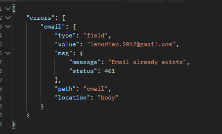
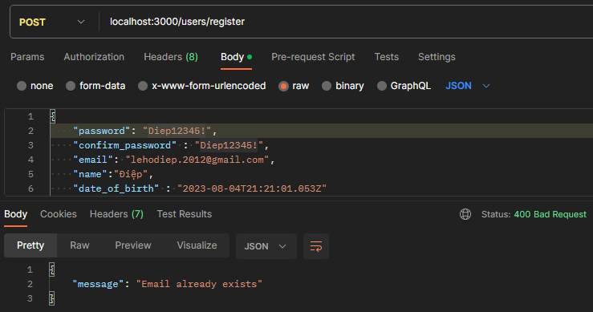
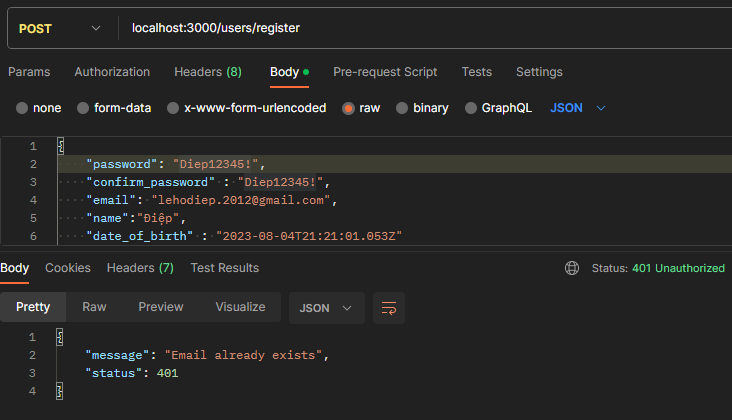
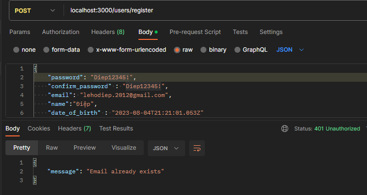
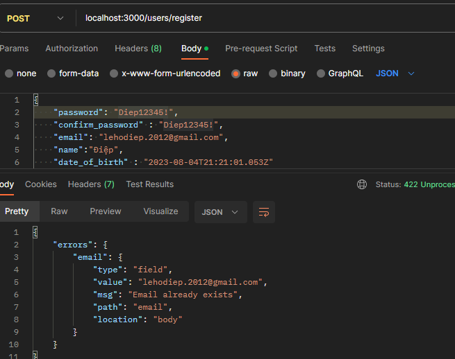
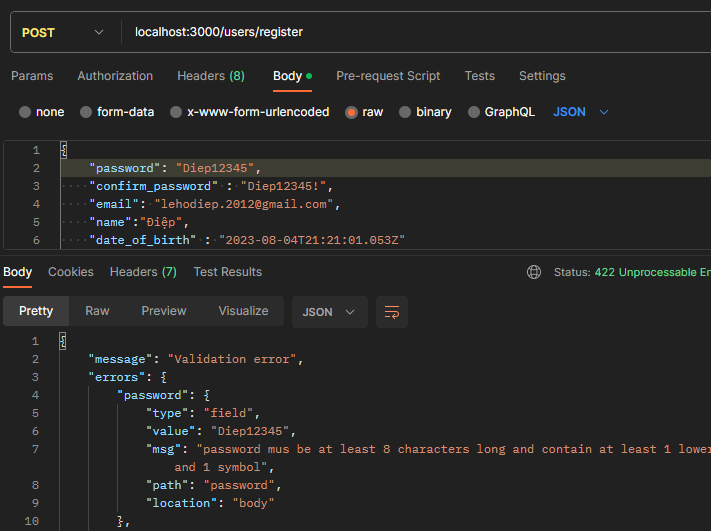
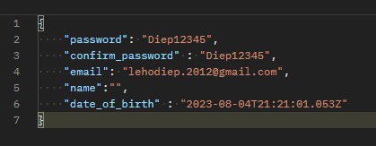
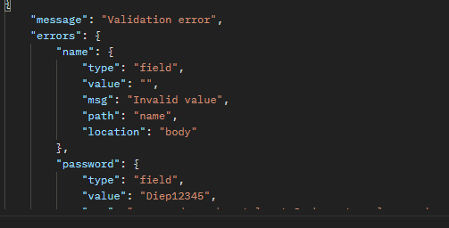
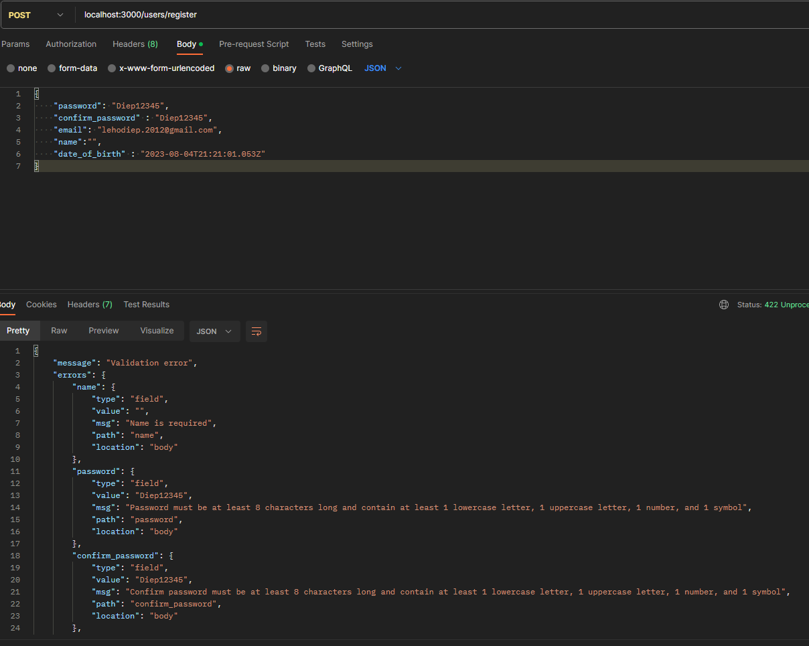

# Chuẩn hóa xử lý lỗi

ta sẽ chuẩn hóa quy trình xử lý lỗi giúp cho code của mình sẽ tường minh và rõ ràng hơn

- ở `middleware` thường là nơi check `validate` của `req.body` để kiểm tra xem người dùng có truyền dữ liệu đúng với schema mà mình đã thiết kế hay không, lỗi này thường `status là 422`.
- nhưng nếu lúc gữi request lên mà ngta k gữi `accessToken` thì mình nên gữi về lỗi `status là 401`
- vậy thì **làm sao để phân biệt được khi nào thì nên trả ra status gì**
- làm sao để để khi sai validate thì trả về 422, khi nào chủ động trả ra 401

# cách chuẩn hóa lỗi

- chúng ta nên thống nhất format lỗi trả về cho người dùng

  - lỗi thường: message là đủ , thêm error_infor nếu muốn

    ```ts
    {
        message: string
        error_infor?: any
    }
    ```

  - lỗi validation (422): thiếu trường dữ liệu, sai chuẩn quy định của middleware schema

    ```ts
    {
        message: string
        error: {
            msg: string
            [key: string] : any //có thể có nhiêu key khác nữa thoải mái
        }
    }
    ```

- với các mã status khác nhau, nó đại diện cho các lỗi khác nhau

  - trong folder `constants` ta tạo `httpStatus.ts`, code như sau

    ```ts
    const HTTP_STATUS = {
      OK: 200,
      CREATED: 201,
      ACCEPTED: 202,
      NO_CONTENT: 204,
      UNPROCESSABLE_ENTITY: 422,
      UNAUTHORIZED: 401,
      NOT_FOUND: 404,
      INTERNAL_SERVER_ERROR: 500,
    };

    export default HTTP_STATUS;
    ```

- giờ ta sẽ tạo ra 1 kiểu dữ liệu Errors để lưu trữ các cấu trúc lỗi trả về, vào folder `models` tạo file `Errors.ts`

  - trong file `Errors.ts`

    ```ts
    //ở đây thường mình sẽ extend Error để nhận đc báo lỗi ở dòng nào

    export class ErrorWithStatus {
      message: string;
      status: number;
      constructor({ message, status }: { message: string; status: number }) {
        this.message = message;
        this.status = status;
      }
    }
    ```

  - giờ mình vào `users.middleware.ts` đoạn `validate email` để tạo ra lỗi bằng class `ErrorWithStatus` của mình
    ```ts
        ...
        export const registerValidator = validate(
            ...
            email: {
                notEmpty: true,
                isEmail: true,
                trim: true,
                custom: {
                    options: async (value) => {
                    const isExistEmail = await usersService.checkEmailExist(value)
                    if (isExistEmail) {
                        throw new ErrorWithStatus({ message: 'Email already exists', status: 401 })
                    }
                    return true
                    }
                }
            },
        ...
    ```
  - chỉnh lại `validator.ts` để mặc định lỗi là `status 422` khi có `lỗi khác thì` sẽ dùng `status của lỗi` đó

    ```ts
    export const validate = (
      validation: RunnableValidationChains<ValidationChain>
    ) => {
      return async (
        req: express.Request,
        res: express.Response,
        next: express.NextFunction
      ) => {
        await validation.run(req); //hàm tìm lỗi của middleware schema và đưa vào req

        const errors = validationResult(req); //funct này giúp ta lấy lỗi ra từ biến req
        const errorObject = errors.mapped(); //hàm này giúp ta lấy lỗi ra dưới dạng object

        if (errors.isEmpty()) {
          return next();
        }
        res.status(422).json({ errors: errorObject });
      };
    };
    ```

    trong đó `errorObject` có dạng như sau, ví dụ ta sai email
    

    nên ta xử lý như sau

    ```ts
    export const validate = (
      validation: RunnableValidationChains<ValidationChain>
    ) => {
      return async (
        req: express.Request,
        res: express.Response,
        next: express.NextFunction
      ) => {
        await validation.run(req);
        const errors = validationResult(req);
        const errorObject = errors.mapped(); //hàm này giúp ta lấy lỗi ra dưới dạng object
        //xử lý object lỗi
        for (const key in errorObject) {
          //phân rã msg của 1 cái lỗi ra
          const { msg } = errorObject[key];
          //"msg instanceof ErrorWithStatus " vừa giúp mình biết rằng có lỗi k, mà vừa định nghĩa cho msg
          //và khi tường minh thì msg có  thể .status được
          //nếu có lỗi của ErrorWithStatus thì mình return và next(msg): ném lỗi cho default error handler xử lý
          //thay vì để nó chạy xuống và res.status(422).....
          //nhờ vậy mà nếu có lỗi gì khác error do validator tạo ra thì nó sẽ k vào lỗi 422
          if (
            msg instanceof ErrorWithStatus &&
            msg.status !== HTTP_STATUS.UNPROCESSABLE_ENTITY
          ) {
            return next(msg);
          }
        }

        if (errors.isEmpty()) {
          return next();
        }

        res.status(422).json({ errors: errorObject });
      };
    };
    ```

    kết quả lỗi thu được gọn gàng nhưng status bị sai, nó đang là 400
    

  - `sai status` là do `default error handler` của chúng ta `luôn đang res status 400`, ta sẽ cần xử lý lại

    ```ts
    app.use((err: any, req: Request, res: Response, next: NextFunction) => {
      console.log("lỗi nè " + err.message);
      res.status(400).json({ message: err.message });
    });
    ```

    - thế nên ta sẽ tách `error handler này` thành 1 `middleware` riêng, vậy nên trong folder `middleware` tạo file `error.middlewares.ts` và code

      ```ts
      import { NextFunction, Request, Response } from "express";
      import HTTP_STATUS from "~/constants/httpStatus";

      export const defaultErrorHandler = (
        err: any,
        req: Request,
        res: Response,
        next: NextFunction
      ) => {
        //err là lỗi từ các nơi khác truyền xuống, và ta đã quy ước lỗi phải là 1 object có 2 thuộc tính: status và message
        res.status(err.status || HTTP_STATUS.INTERNAL_SERVER_ERROR).json(err);
      };
      ```

    - fix lại `index.ts` đoạn nãy thành

      ```ts
      app.use(defaultErrorHandler);
      ```

    - kết quả thu về, đã đầy đủ
      
      vì ta `.json(err)` error mà error lại chứa status và message nên bị thừa status ta có thể khắc phục bằng cách `.json(err.message)` nhưng như vậy k hay

  - ta sẽ trả ra object k có status bằng cách `delete err.status` nhưng như vậy thì rất kỳ
  - ta sẽ dùng `lodash` để xử vấn đề thừa status trên

    cài đặt [`lodash`](https://lodash.com/docs): một thư viện chứa các hàm tiện ích cho js

    ```bash
    npm i lodash
    npm install @types/lodash -D
    ```

    file `error.middlewares.ts` và code

    ```ts
    import { NextFunction, Request, Response } from "express";
    import HTTP_STATUS from "~/constants/httpStatus";

    export const defaultErrorHandler = (
      err: any,
      req: Request,
      res: Response,
      next: NextFunction
    ) => {
      res
        .status(err.status || HTTP_STATUS.INTERNAL_SERVER_ERROR)
        .json(omit(err, ["status"]));
    };
    ```

    [omit](https://lodash.com/docs/4.17.15#omit) là 1 function trong lodash giúp trả ra object giống err nhưng đã loại bỏ status

    thành quả
    

- ban đầu ta dùng lỗi của email để làm ví dụ demo lỗi khác 422, nhưng thực tế thì lỗi `email tồn lại rồi` không
  phải là lỗi 422. nên ta sẽ viết lại bth cho schema đó
  ```ts
    email: {
      notEmpty: true,
      isEmail: true,
      trim: true,
      custom: {
        options: async (value) => {
          const isExistEmail = await usersService.checkEmailExist(value)
          if (isExistEmail) {
            throw new Error('Email already exists')//fix đoạn này
          }
          return true
        }
      }
    },
  ```
- sau khi test lại ta thấy rằng lỗi mặc định của validator quá nhiều thông tin và quá xấu
  
- nên ta sẽ tạo cho những lỗi validator 1 dạng lỗi,
- tạo ra các `message error` để gữi cho người dùng, trong folder `constants` tạo file `messages.ts`viết như sau

  ```ts
  export const USERS_MESSAGES = {
    VALIDATION_ERROR: "Validation error",
  } as const; //để k ai chỉnh đc
  ```

- vào file `Errors.ts` tạo thêm class `EntityError` dành để tạo ra lỗi phát sinh trong validator(lỗi 422)

```ts
//đầu file
//tạo kiểu lỗi giống thiết kế ban đâu
//tạo kiểu lỗi giống thiết kế ban đâu
type ErrorsType = Record<
  string,
  {
    msg: string
    [key: string]: any //này nghĩa ra ngoài ra muốn thêm vào gì thì thêm
  }
>
// { [key: string]:  {
//     [field: string]:{
//         msg: string
//     }
// }
//}
export class ErrorWithStatus {
    ....
}

export class EntityError extends ErrorWithStatus {
  errors: ErrorsType
  //truyển message mặt định
  constructor({
    message = USERS_MESSAGES.VALIDATION_ERROR,
    errors
  }: {
    message?: string
    errors: ErrorsType
  }) {
    super({ message, status: HTTP_STATUS.UNPROCESSABLE_ENTITY }) //tạo lỗi có status 422
    this.errors = errors
  }
}

```

- xử lý lại đoạn `validation.ts`

```ts
export const validate = (
  validation: RunnableValidationChains<ValidationChain>
) => {
  return async (
    req: express.Request,
    res: express.Response,
    next: express.NextFunction
  ) => {
    await validation.run(req); //hàm tìm lỗi của middleware schema và đưa vào req

    const errors = validationResult(req); //funct này giúp ta lấy lỗi ra từ biến req
    // không lỗi thì next() để qua middleware tiếp theo
    if (errors.isEmpty()) {
      return next();
    }
    const errorObject = errors.mapped(); //hàm này giúp ta lấy lỗi ra dưới dạng object
    const entityError = new EntityError({ errors: {} }); //tạo object lỗi mặc định
    //xử lý object lỗi

    for (const key in errorObject) {
      const { msg } = errorObject[key];
      //nếu lỗi phát sinh là lỗi của ErrorWithStatus thì ném lỗi cho default error handler xử lý
      if (
        msg instanceof ErrorWithStatus &&
        msg.status !== HTTP_STATUS.UNPROCESSABLE_ENTITY
      ) {
        return next(msg);
      }
      // nếu lỗi phát sinh không phải từ ErrorWithStatus thì lưu vào entityError
      entityError.errors[key] = errorObject[key];
    }
    //sau khi tổng hợp xong thì ném ra sau
    next(entityError);
  };
};
```

kết quả thu được đã có message, nhưng lỗi k rỏ ràng, thường là `msg: invalid value`




# Khai báo message validation

- cập nhật thêm nhiều `messages error` cho validator của user schema, ta sẽ thêm cho `messages.ts` như sau :

  ```ts
  export const USERS_MESSAGES = {
    VALIDATION_ERROR: "Validation error",
    //name
    NAME_IS_REQUIRED: "Name is required",
    NAME_MUST_BE_A_STRING: "Name must be a string",
    NAME_LENGTH_MUST_BE_FROM_1_TO_100: "Name length must be from 1 to 100",
    //email
    EMAIL_ALREADY_EXISTS: "Email already exists",
    EMAIL_IS_REQUIRED: "Email is required",
    EMAIL_IS_INVALID: "Email is invalid",
    //password
    PASSWORD_IS_REQUIRED: "Password is required",
    PASSWORD_MUST_BE_A_STRING: "Password must be a string",
    PASSWORD_LENGTH_MUST_BE_FROM_8_TO_50:
      "Password length must be from 8 to 50",
    PASSWORD_MUST_BE_STRONG:
      "Password must be at least 8 characters long and contain at least 1 lowercase letter, 1 uppercase letter, 1 number, and 1 symbol",
    //confirmPassword
    CONFIRM_PASSWORD_IS_REQUIRED: "Confirm password is required",
    CONFIRM_PASSWORD_MUST_BE_A_STRING: "Confirm password must be a string",
    CONFIRM_PASSWORD_LENGTH_MUST_BE_FROM_8_TO_50:
      "Confirm length must be from 8 to 50",
    CONFIRM_PASSWORD_MUST_BE_STRONG:
      "Confirm password must be at least 8 characters long and contain at least 1 lowercase letter, 1 uppercase letter, 1 number, and 1 symbol",
    CONFIRM_PASSWORD_MUST_BE_THE_SAME_AS_PASSWORD:
      "Confirm password must be the same as password",
    //dateOfBirth
    DATE_OF_BIRTH_BE_ISO8601: "Date of birth must be ISO8601",
    //user
    EMAIL_OR_PASSWORD_IS_INCORRECT: "Email or password is incorrect",
  } as const;
  ```

- cài đặt các message này cho middleware `registerValidator` trong `users.middlewares.ts`

  ```ts
  export const registerValidator = validate(
    checkSchema({
      name: {
        notEmpty: {
          errorMessage: USERS_MESSAGES.NAME_IS_REQUIRED,
        },
        isString: {
          errorMessage: USERS_MESSAGES.NAME_MUST_BE_A_STRING,
        },
        trim: true,
        isLength: {
          options: {
            min: 1,
            max: 100,
          },
          errorMessage: USERS_MESSAGES.NAME_LENGTH_MUST_BE_FROM_1_TO_100,
        },
      },
      email: {
        notEmpty: {
          errorMessage: USERS_MESSAGES.EMAIL_IS_REQUIRED,
        },
        isEmail: {
          errorMessage: USERS_MESSAGES.EMAIL_IS_INVALID,
        },
        trim: true,
        custom: {
          options: async (value) => {
            const isExistEmail = await usersService.checkEmailExist(value);
            if (isExistEmail) {
              throw new Error(USERS_MESSAGES.EMAIL_ALREADY_EXISTS);
            }
            return true;
          },
        },
      },
      password: {
        notEmpty: {
          errorMessage: USERS_MESSAGES.PASSWORD_IS_REQUIRED,
        },
        isString: {
          errorMessage: USERS_MESSAGES.PASSWORD_MUST_BE_A_STRING,
        },
        isLength: {
          options: {
            min: 8,
            max: 50,
          },
          errorMessage: USERS_MESSAGES.PASSWORD_LENGTH_MUST_BE_FROM_8_TO_50,
        },
        isStrongPassword: {
          options: {
            minLength: 8,
            minLowercase: 1,
            minUppercase: 1,
            minNumbers: 1,
            minSymbols: 1,
            // returnScore: false
            // false : chỉ return true nếu password mạnh, false nếu k
            // true : return về chất lượng password(trên thang điểm 10)
          },
          errorMessage: USERS_MESSAGES.PASSWORD_MUST_BE_STRONG,
        },
      },
      confirm_password: {
        notEmpty: {
          errorMessage: USERS_MESSAGES.CONFIRM_PASSWORD_IS_REQUIRED,
        },
        isString: {
          errorMessage: USERS_MESSAGES.CONFIRM_PASSWORD_MUST_BE_A_STRING,
        },
        isLength: {
          options: {
            min: 8,
            max: 50,
          },
          errorMessage:
            USERS_MESSAGES.CONFIRM_PASSWORD_LENGTH_MUST_BE_FROM_8_TO_50,
        },
        isStrongPassword: {
          options: {
            minLength: 8,
            minLowercase: 1,
            minUppercase: 1,
            minNumbers: 1,
            minSymbols: 1,
          },
          errorMessage: USERS_MESSAGES.CONFIRM_PASSWORD_MUST_BE_STRONG,
        },
        custom: {
          options: (value, { req }) => {
            if (value !== req.body.password) {
              throw new Error(
                USERS_MESSAGES.CONFIRM_PASSWORD_MUST_BE_THE_SAME_AS_PASSWORD
              );
            }
            return true;
          },
        },
      },
      date_of_birth: {
        isISO8601: {
          options: {
            strict: true,
            strictSeparator: true,
          },
          errorMessage: USERS_MESSAGES.DATE_OF_BIRTH_BE_ISO8601,
        },
      },
    })
  );
  ```

- thành quả là các lỗi đã đc báo cụ thể và chính xác
  
