# các chức năng của user

## I - Verify email

- tham khảo luồng xử lý verify email ở đây
- khi mà người dùng đăng ký tài khoản thì mình sẽ gữi 1 link xác thực vào email của người ta
- khi họ click vào thì mình sẽ change status verify cho account của người ta
- nếu account đã verify thì sử dụng bth, chưa thì chỉ đăng nhập đc mà thôi

<iframe style="border: 1px solid rgba(0, 0, 0, 0.1);" width="800" height="450" src="https://www.figma.com/embed?embed_host=share&url=https%3A%2F%2Fwww.figma.com%2Ffile%2FBeECRO014VsTDbyiWkgUyy%2FUntitled%3Ftype%3Ddesign%26node-id%3D0%253A1%26mode%3Ddesign%26t%3DjFTd64xLgUqRUEYh-1" allowfullscreen></iframe>

- khi mà ta đăng ký tài khoản, ngoài việc server gữi lại ta `at` và `rf` thì còn phải gữi cho ta `email_verify_token` để ta sử dụng nó cho việc `verify` thông qua đường dẫn

  - nhưng trong `users.service.ts > register` ta chỉ mới tạo `at` và `rf` nên giờ trong `users.service.ts` ta sẽ viết hàm `signEmailVerifyToken`
  - trong `.env` thêm `EMAIL_VERIFY_TOKEN_EXPIRE_IN = '7d'`

  ```ts
  private signEmailVerifyToken(user_id: string) {
    return signToken({
      payload: { user_id, token_type: TokenType.EmailVerificationToken },
      options: { expiresIn: process.env.EMAIL_VERIFY_TOKEN_EXPIRE_IN },
      privateKey: process.env.JWT_SECRET_EMAIL_VERIFY_TOKEN as string //thêm
    })
  }
  ```

  - và xài nó ở `register` như sau

  ```ts
  async register(payload: RegisterReqBody) {
    const user_id = new ObjectId()
    const email_verify_token = await this.signEmailVerifyToken(user_id.toString())
    //ta đành phải tự tạo user_id thay vì để mongodb tự tạo
    //vì ta cần user_id để tạo email_verify_token
    const result = await databaseService.users.insertOne(
      new User({
        ...payload,
        _id: user_id,
        email_verify_token,
        date_of_birth: new Date(payload.date_of_birth),
        password: hashPassword(payload.password)
      })
    )
    const [access_token, refresh_token] = await this.signAccessAndRefreshToken(user_id.toString())//fix chỗ này
    await databaseService.refreshTokens.insertOne(
      new RefreshToken({ user_id: new ObjectId(user_id), token: refresh_token })
    )

    console.log('email_verify_token', email_verify_token) //mô phỏng send email, test xong xóa
    return { access_token, refresh_token }
    //ta sẽ return 2 cái này về cho client
    //thay vì return user_id về cho client
  }
  ```

- test chức năng register lại xem có nhận đc `email verify token` không

  - trong mongo user mới tạo có `email verify token` không ?

- vào `users.routes.ts` tạo trước route `verify-email` thiếu middleware validator, controller

```ts
/*
des: verify email khi người dùng nhấn vào cái link trong email, họ sẽ gữi lên email_verify_token
để ta kiểm tra, tìm kiếm user đó và update account của họ thành verify, 
đồng thời gữi at rf cho họ đăng nhập luôn, k cần login
path: /verify-email
method: POST
không cần Header vì chưa đăng nhập vẫn có thể verify-email
body: {email_verify_token: string}
*/
usersRouter.post(
  "/verify-email",
  emailVerifyTokenValidator,
  wrapAsync(emailVerifyController)
);
//emailVerifyTokenValidator và emailVerifyController chưa có giờ tạo
```

- giờ ta tạo `emailVerifyTokenValidator`, nó giống với `refreshTokenValidator`

  - trong `message.ts` thêm `EMAIL_VERIFY_TOKEN_IS_REQUIRED: 'Email verify token is required'`
  - `type.d.ts` thêm dịnh dạng cho decoded_email_verify_token
    ```ts
    interface Request {
      user?: User;
      decoded_authorization?: TokenPayload;
      decoded_refresh_token?: TokenPayload;
      decoded_email_verify_token?: TokenPayload;
    }
    ```
  - `emailVerifyTokenValidator`

    ```ts
    export const emailVerifyTokenValidator = validate(
      checkSchema(
        {
          email_verify_token: {
            trim: true, //thêm
            custom: {
              options: async (value: string, { req }) => {
                //check xem người dùng có gữi lên email_verify_token không, nếu k thì lỗi
                if (!value) {
                  throw new ErrorWithStatus({
                    message: USERS_MESSAGES.EMAIL_VERIFY_TOKEN_IS_REQUIRED,
                    status: HTTP_STATUS.UNAUTHORIZED, //401
                  });
                }
                try {
                  //nếu có thì ta verify nó để có đc thông tin của người dùng
                  const decoded_email_verify_token = await verifyToken({
                    token: value,
                    secretOrPublicKey: process.env
                      .JWT_SECRET_EMAIL_VERIFY_TOKEN as string,
                  });

                  //nếu có thì ta lưu decoded_email_verify_token vào req để khi nào muốn biết ai gữi req thì dùng
                  (req as Request).decoded_email_verify_token =
                    decoded_email_verify_token;
                } catch (error) {
                  //trong middleware này ta throw để lỗi về default error handler xử lý
                  if (error instanceof JsonWebTokenError) {
                    //nếu lỗi thuộc verify thì ta sẽ trả về lỗi này
                    throw new ErrorWithStatus({
                      message: capitalize((error as JsonWebTokenError).message),
                      status: HTTP_STATUS.UNAUTHORIZED, //401
                    });
                  }
                  //còn nếu không phải thì ta sẽ trả về lỗi do ta throw ở trên try
                  throw error; // này là lỗi đã tạo trên try
                }

                return true; //nếu không có lỗi thì trả về true
              },
            },
          },
        },
        ["body"]
      )
    );
    ```

- tạo`emailVerifyController` trong `users.controllers.ts`

  - trong `message.ts` thêm `USER_NOT_FOUND: 'User not found'` , `EMAIL_ALREADY_VERIFIED_BEFORE: 'Email already verified before'` và `EMAIL_VERIFY_SUCCESS: 'Email verify success'`
  - việc `verify email` sẽ dẫn tới việc vào db và cập nhật lại `email_verify_token` của user thành `''`
    nên ta vào `users.service.ts` viết hàm `verifyEmail(user_id) `, hàm sẽ dùng `user_id` để tìm `user` và cập nhật `email_verify_token` thành `''`

    ```ts
    async verifyEmail(user_id: string) {
        //token này chứa access_token và refresh_token
        const [token] = await Promise.all([
            this.signAccessAndRefreshToken(user_id),
            databaseService.users.updateOne(
                { _id: new ObjectId(user_id) }, //tìm user thông qua _id
                { $set: { email_verify_token: '', updated_at: new Date(), verify: UserVerifyStatus.Verified } }
                //set email_verify_token thành rỗng,và cập nhật ngày cập nhật, cập nhật status của verify
            )
        ])
        //destructuring token ra
        const [access_token, refresh_token] = token
        //lưu refresg_token vào database
        await databaseService.refreshTokens.insertOne(
          new RefreshToken({ user_id: new ObjectId(user_id), token: refresh_token })
        )
        //nếu họ verify thành công thì gữi họ access_token và refresh_token để họ đăng nhập luôn
        return {
            access_token,
            refresh_token
        }
    }
    ```

  - `emailVerifyController`

    ```ts
    export const emailVerifyController = async (
      req: Request,
      res: Response,
      next: NextFunction
    ) => {
      // const { email_verify_token } = req.body
      // const user = await databaseService.users.findOne({ email_verify_token: email_verify_token })
      //ta có thể tìm user thông qua email_verify_token do người dùng gui lên lên thế này nhưng hiệu năng sẽ kém
      //nên thay vào đó ta sẽ lấy thông tin _id của user từ decoded_email_verify_token mà ta thu đc từ middleware trước
      //và tìm user thông qua _id đó
      const { user_id } = req.decoded_email_verify_token as TokenPayload;
      const user = await databaseService.users.findOne({
        _id: new ObjectId(user_id),
      }); //hiệu năng cao hơn
      //nếu k có user thì cho lỗi 404: not found

      if (user === null) {
        return res.status(HTTP_STATUS.NOT_FOUND).json({
          message: USERS_MESSAGES.USER_NOT_FOUND,
        });
      }
      //nếu mà email_verify_token là rỗng: tức là account đã đc verify email trước đó rồi
      //thì mình sẽ trả về status 200 ok, với message là đã verify email trước đó rồi
      //chứ không trả về lỗi, nếu k thì client sẽ bối rối
      if (user.email_verify_token === "") {
        //mặc định là status 200
        return res.json({
          message: USERS_MESSAGES.EMAIL_ALREADY_VERIFIED_BEFORE,
        });
      }
      const result = await usersService.verifyEmail(user_id);
      //để cập nhật lại email_verify_token thành rỗng và tạo ra access_token và refresh_token mới
      //gữi cho người vừa request email verify đang nhập
      return res.json({
        message: USERS_MESSAGES.EMAIL_VERIFY_SUCCESS,
        result: result,
      });
    };
    ```

- giờ ta sẽ test lại
  - đăng ký tài khoản mới
    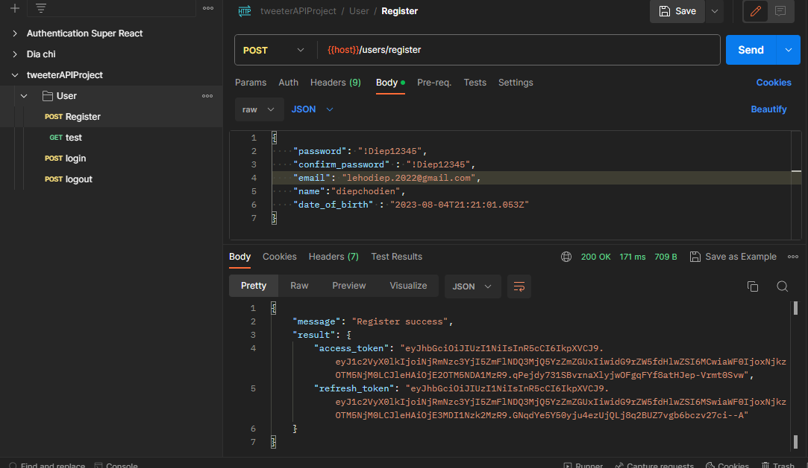
  - tạo `email verify` sử dụng email_verify_token có trong terminal
    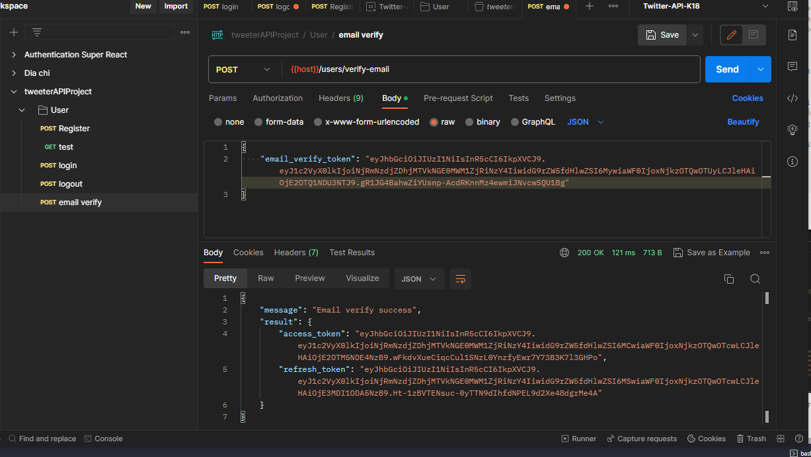
  - nếu ta nhấn lại lần nữa thì nó k cho vì account lúc này đã verify email từ trước
    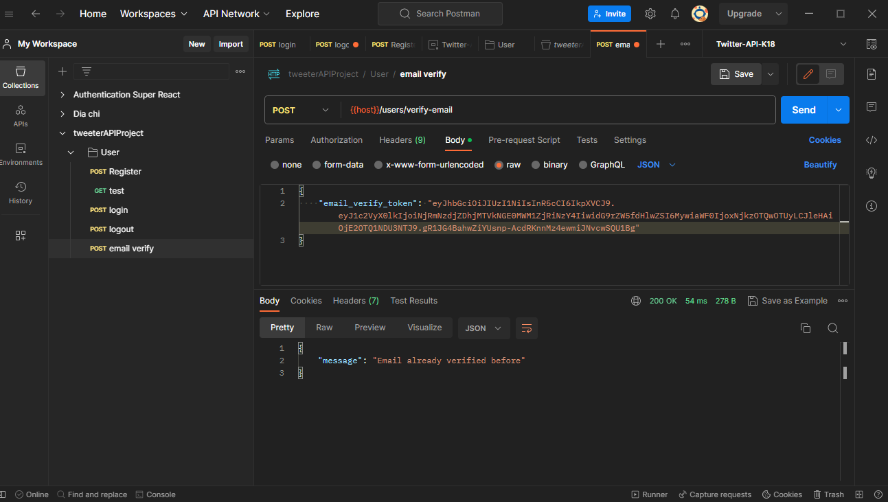
  - truyền sai email_verify_token đc 401
    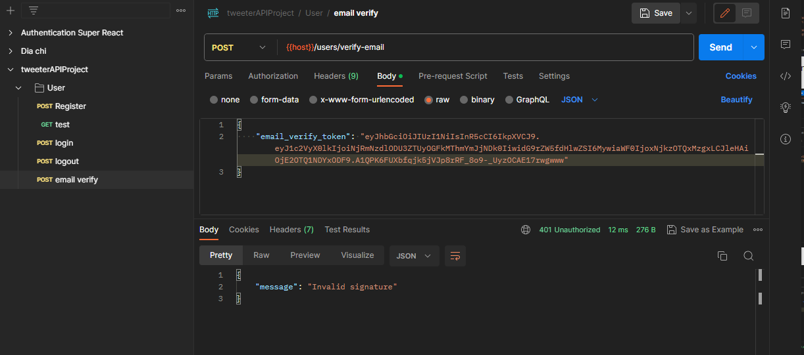
  - truyền thiếu email_verify_token
    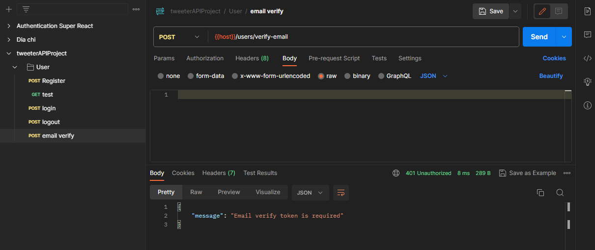

## cập nhật thời gian với \$currentDate và $$NOW

ta có thể cập nhật thời gian `update_at: new Date()` trong mongoDB mà không dùng đến `new Date()`

- trong quá trình cập nhật verify thì có 2 bước như sau
  - request chạy: tạo ra giá trị cập nhật, validator
  - mongodb tiến hành cập nhật
- trong quá trình trên, cái new Date() của ta được tạo ra trong quá trình, request chạy, nên ta chỉ lưu được thời gian lúc đang xử lý request, còn thời gian thực sự cập nhật ta lại k lưu đc, tạo ra độ trễ
- vào `users.services.ts>emailverify` thêm và cập nhật như sau, vậy là xong, chênh lệch khoản 100ms(rất nhỏ)

  ```ts

  //cách 2 $currentDate
  {
    $set: { email_verify_token: '', verify: UserVerifyStatus.Verified },
    $currentDate: {
      updated_at: true
    }
  }

    //cách 1 $$NOW: nên xài cách này, nó ít lỗi
  [{
    $set: { email_verify_token: '', updated_at: "$$NOW", verify: UserVerifyStatus.Verified },
  }]

  ```

# resend verify email

- khi client đăng ký tài khoản, thì mình sẽ gữi 1 link verify account cho
  client thông qua email, nhưng đôi khi mail có thể bị thất lạc, ta sẽ làm
  chức năng gữi lại email
- chức năng này đơn giản là gữi email-verify-token (mới|cũ tùy vào business của mình) cho email được client cung cấp là đc

- trong file `users.routes.ts` tạo route `resend-verify-email`

  ```ts
  /*
  des:gữi lại verify email khi người dùng nhấn vào nút gữi lại email,
  path: /resend-verify-email
  method: POST
  Header:{Authorization: Bearer <access_token>} //đăng nhập mới cho resend email verify
  body: {}
  */
  usersRouter.post(
    "/resend-verify-email",
    accessTokenValidator,
    wrapAsync(resendEmailVerifyController)
  );

  //vì người dùng sẽ truyền lên accesstoken, nên ta sẽ dùng lại accessTokenValidator để kiểm tra
  //accesstoken đó

  //:
  //resendEmailVerifyController:
  //    1. kiểm tra xem account đã verify chưa, nếu nó verify rồi thì ta
  //      không cần tiến hành gữi email lại cho client
  //    2. nếu chưa verify thì controller ta sẽ tạo để xử lý việc resend email verify
  //    controller này ta chưa code , giờ ta tiến hành code
  ```

- nhờ vào accessTokenValidator, req của ta đã có `decoded_authorization` lưu thông tin account
  muốn verify email
  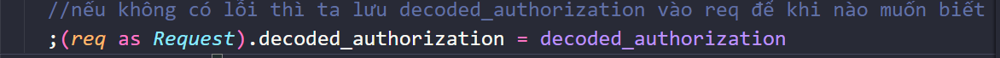
- nên khi qua `resendEmailVerifyController` ta chỉ cần `req.decoded_authorization` là có thể
  biết `user._id` của account đang gữi yêu cầu, từ đó kiểm tra xem account đó verify hay chưa

- ta viết `resendEmailVerify` cho `users.services.ts` vì hành động này là truy xuất `user` trong database

  ```ts
  async resendEmailVerify(user_id: string) {
      //tạo ra email_verify_token mới
      const email_verify_token = await this.signEmailVerifyToken(user_id)
      //chưa làm chức năng gữi email, nên giả bộ ta đã gữi email cho client rồi, hiển thị bằng console.log
      console.log('resend verify email token', email_verify_token)
      //vào database và cập nhật lại email_verify_token mới trong table user
      await databaseService.users.updateOne({ _id: new ObjectId(user_id) }, [
        {
          $set: { email_verify_token: email_verify_token, updated_at: '$$NOW' }
        }
      ])
      //trả về message
      return {
        message: USERS_MESSAGES.RESEND_VERIFY_EMAIL_SUCCESS
      }
    }
  ```

- vào `messages.ts` thêm ` RESEND_VERIFY_EMAIL_SUCCESS: 'Resend verify email success'`

- vậy nếu ai gọi `resendEmailVerify` và đưa vào user_id, ta sẽ tạo` email_verify_token` mới, gữi email,
  cập nhật `email_verify_token` cho account đó trên database, và thông báo thành công

- ta tiến hành vào `user.controllers.ts` làm `resendEmailVerifyController`

  ```ts
  export const resendEmailVerifyController = async (
    req: Request,
    res: Response,
    next: NextFunction
  ) => {
    //khi đến đây thì accesstokenValidator đã chạy rồi => access_token đã đc decode
    //và lưu vào req.user, nên trong đó sẽ có user._id để tao sử dụng
    const { user_id } = req.decoded_authorization as TokenPayload; //lấy user_id từ decoded_authorization
    //từ user_id này ta sẽ tìm user trong database
    const user = await databaseService.users.findOne({
      _id: new ObjectId(user_id),
    });
    //nếu k có user thì trả về lỗi 404: not found
    if (!user) {
      return res.status(HTTP_STATUS.NOT_FOUND).json({
        message: USERS_MESSAGES.USER_NOT_FOUND,
      });
    }
    //nếu user đã verify email trước đó rồi thì trả về lỗi 400: bad request
    if (user.verify == UserVerifyStatus.Verified) {
      return res.json({
        message: USERS_MESSAGES.EMAIL_ALREADY_VERIFIED_BEFORE,
      });
    }
    //nếu user chưa verify email thì ta sẽ gữi lại email verify cho họ
    //cập nhật email_verify_token mới và gữi lại email verify cho họ
    const result = await usersService.resendEmailVerify(user_id);
    //result chứa message nên ta chỉ cần trả  result về cho client
    return res.json(result);
  };
  ```

- test code bằng postman

  - thêm script test cho register

  ```js
  pm.test("register thành công", function () {
    pm.response.to.have.status(200);
    let responseJson = pm.response.json();
    const { access_token, refresh_token } = responseJson.result;
    pm.environment.set("access_token", access_token);
    pm.environment.set("refresh_token", refresh_token);
  });
  ```

  - đăng ký 1 tài khoản mới có email "lehodiep.2030@gmail.com"
    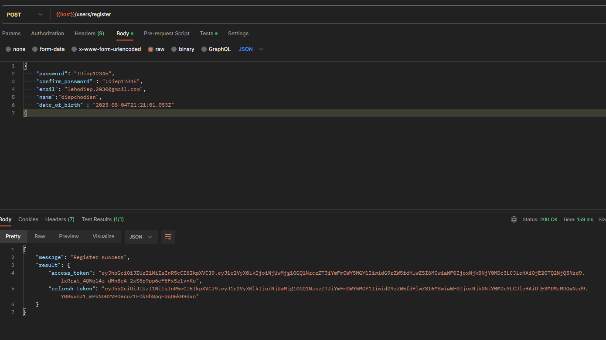
    từ đó ta có access token để dùng request resend email verify

  - tạo request mới như này
    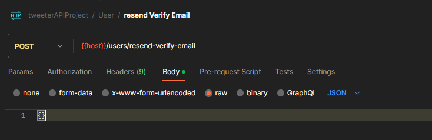
    và chạy thử ta được
    resend verify email token ...
  - vào mongoDB kiểm tra account có email "lehodiep.2030@gmail.com" có email verify token khớp với
    ta hay không
    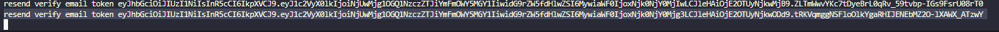
    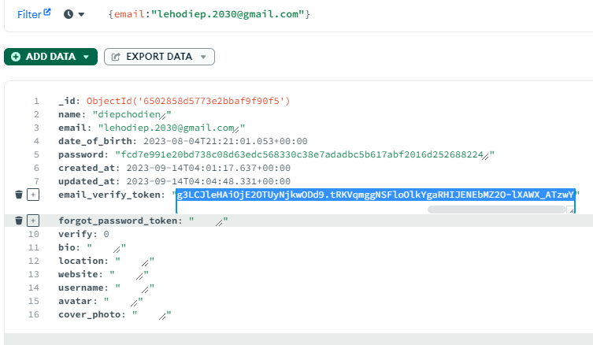

- tiện thế cập nhật 1 vài thứ như sau
- 1.  ta chưa khai báo `LoginReqBody` và `VerifyEmailReqBody`, nên ta vào `User.requests.ts` và tạo
      mình nên quy ước nhận từ body của request cái gì, nếu mà request nào k cần truyền lên body như `resend-email-verify` thì khỏi làm

  ```ts
  export interface LoginReqBody {
    email: string;
    password: string;
  }
  export interface VerifyEmailReqBody {
    email_verify_token: string;
  }
  ```

- 2. chỉnh lại các controller tương ứng

  ```ts
  export const loginController = async (req: Request<ParamsDictionary, any, LoginReqBody>, res: Response) => {...

  export const emailVerifyController = async (
    req: Request<ParamsDictionary, any, VerifyEmailReqBody>,
    res: Response,
    next: NextFunction
  )
  ```

  **đã kiểm tra doc đến đây, phần dưới này có thể thiếu sót**

# Forgot password

- chức năng quên mật khẩu diễn ra như sau

  - 1.  ta quên mật khẩu, ta bấn vào chức năng `quên mật khẩu`
  - 2.  client sẽ được yêu cập nhập email
  - 3.  ta gữi link đổi mật khẩu cho email này
  - 3.  người dùng vào email>link và được dẫn đến trang đổi mật khẩu mới
    <iframe style="border: 1px solid rgba(0, 0, 0, 0.1);" width="1200" height="450" src="https://www.figma.com/embed?embed_host=share&url=https%3A%2F%2Fwww.figma.com%2Ffile%2FBeECRO014VsTDbyiWkgUyy%2FUntitled%3Ftype%3Ddesign%26node-id%3D0%253A1%26mode%3Ddesign%26t%3DjFTd64xLgUqRUEYh-1" allowfullscreen></iframe>
  - theo hình trên thì giờ ta sẽ làm trước đến đoạn send email
    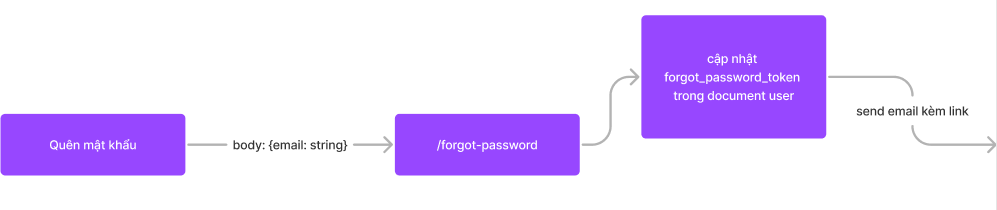

- vào `users.routes.ts` tạo route `/forgot-password`

```ts
/*
des: cung cấp email để reset password, gữi email cho người dùng
path: /forgot-password
method: POST
Header: không cần, vì  ngta quên mật khẩu rồi, thì sao mà đăng nhập để có authen đc
body: {email: string}
*/
usersRouter.post(
  "/forgot-password",
  forgotPasswordValidator,
  wrapAsync(forgotPasswordController)
);
```

- trong mô ta khi dùng `/forgot-password` ta sẽ có body: {email: string} nên ta vào `User.requests.ts` thêm `ForgotPasswordReqBody`

  ```ts
  export interface ForgotPasswordReqBody {
    email: string;
  }
  ```

- ta cần kiểm tra xem email có valid(email này thuộc user nào) không ? trước khi send email
  nên ta sẽ vào `users.middlewares.ts` tạo middleware tên `forgotPasswordValidator`

  ```ts
  export const forgotPasswordValidator = validate(
    checkSchema({
      email: {
        isEmail: {
          errorMessage: USERS_MESSAGES.EMAIL_IS_INVALID,
        },
        trim: true,
        custom: {
          options: async (value, { req }) => {
            //tìm trong database xem có user nào sở hữu email = value của email người dùng gữi lên không
            const user = await databaseService.users.findOne({
              email: value,
            });
            //nếu không tìm đc user thì nói user không tồn tại
            //khỏi tiến vào controller nữa
            if (user === null) {
              throw new Error(USERS_MESSAGES.USER_NOT_FOUND); //422
            }
            //đến đâu thì oke
            req.user = user; // lưu user mới tìm đc lại luôn, khi nào cần thì xài
            return true;
          },
        },
      },
    })
  );
  ```

- ta sẽ vào database tạo forgot-password-token ,lưu vào database và send email cho ta,
  giờ ta viết hàm `forgotPassword(email:string)` để thực hiện những việc đó
  vì hàm này sẽ vào database nên ta sẽ lưu nó vào trong `users.service.ts`

  ```ts
  //tạo hàm signForgotPasswordToken
  private signForgotPasswordToken(user_id: string) {
    return signToken({
      payload: { user_id, token_type: TokenType.ForgotPasswordToken },
      options: { expiresIn: process.env.FORGOT_PASSWORD_TOKEN_EXPIRE_IN },
      privateKey: process.env.JWT_SECRET_FORGOT_PASSWORD_TOKEN as string //thêm
    })
  }
  //vào .env thêm 2 biến môi trường FORGOT_PASSWORD_TOKEN_EXPIRE_IN, và JWT_SECRET_FORGOT_PASSWORD_TOKEN
  //JWT_SECRET_FORGOT_PASSWORD_TOKEN = '123!@#22'
  //FORGOT_PASSWORD_TOKEN_EXPIRE_IN = '7d'

  async forgotPassword(user_id: string) {
    //tạo ra forgot_password_token
    const forgot_password_token = await this.signForgotPasswordToken(user_id)
    //cập nhật vào forgot_password_token và user_id
    await databaseService.users.updateOne({ _id: new ObjectId(user_id) }, [
      {
        $set: { forgot_password_token: forgot_password_token, updated_at: '$$NOW' }
      }
    ])
    //gữi email cho người dùng đường link có cấu trúc như này
    //http://appblabla/forgot-password?token=xxxx
    //xxxx trong đó xxxx là forgot_password_token
    //sau này ta sẽ dùng aws để làm chức năng gữi email, giờ ta k có
    //ta log ra để test
    console.log('forgot_password_token: ', forgot_password_token)
    return {
      message: USERS_MESSAGES.CHECK_EMAIL_TO_RESET_PASSWORD
    }
  }
  //vào messages.ts thêm CHECK_EMAIL_TO_RESET_PASSWORD: 'Check email to reset password'
  ```

- vào `users.controllers.ts` tạo `forgotPasswordController` và sử dụng `usersService.forgotPassword(email)` vừa tạo

  ```ts
  export const forgotPasswordController = async (
    req: Request<ParamsDictionary, any, ForgotPasswordReqBody>,
    res: Response,
    next: NextFunction
  ) => {
    //middleware forgotPasswordValidator đã chạy rồi, nên ta có thể lấy _id từ user đã tìm đc bằng email
    const { _id } = req.user as User;
    //cái _id này là objectid, nên ta phải chuyển nó về string
    //chứ không truyền trực tiếp vào hàm forgotPassword
    const result = await usersService.forgotPassword(
      (_id as ObjectId).toString()
    );
    return res.json(result);
  };
  ```

- test code

  - tạo request mới
    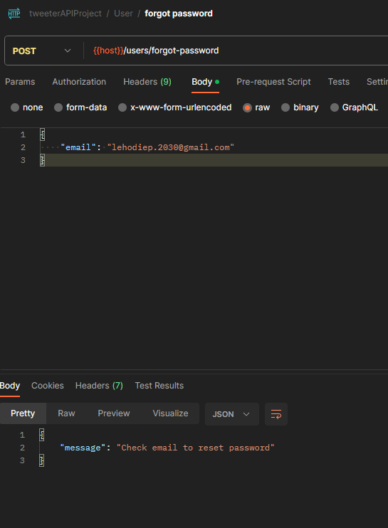
    thành công nên api gữi ta message là hãy check lại email
  - trong email của ta sẽ nhận đc forgot-password-token như này
    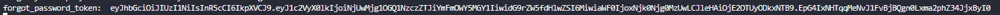
  - ta kiểm tra xem có khớp với database không
    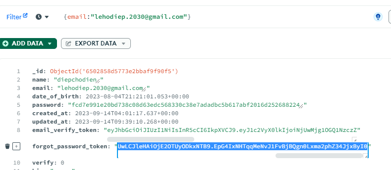
  - truyền sai email
    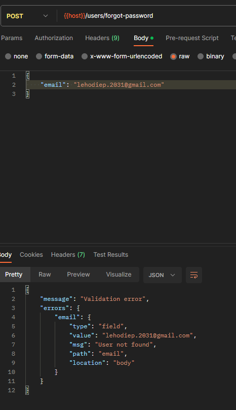

- vậy là client sẽ nhận đc một đường link thông qua email nếu dùng /forgot-password
  nếu họ click vào họ sẽ nhận đc forgot-password-token
  đồng thời họ sẽ được điều hướng đến route `/verify-forgot-password` để kiểm tra và đổi mật khẩu của ta

# Verify forgot password token

- `/verify-forgot-password` thì dùng method POST hay GET đều được
  - nhưng nếu `GET` thì người dùng phải truyền data qua queryStringParam cũng đc
  - còn `POST` thì thông qua body, đỡ nhạy cảm hơn, nên `mình chọn` `POST`
- vào `users.routes.ts` tạo route `/verify-forgot-password`

  ```ts
  /*
  des: Verify link in email to reset password
  path: /verify-forgot-password
  method: POST
  Header: không cần, vì  ngta quên mật khẩu rồi, thì sao mà đăng nhập để có authen đc
  body: {forgot_password_token: string}
  */
  usersRouter.post(
    "/verify-forgot-password",
    verifyForgotPasswordTokenValidator,
    wrapAsync(verifyForgotPasswordTokenController)
  );
  ```

- `user.requests.ts` thêm định nghĩa request body cho verify-forgot-password

```ts
export interface VerifyForgotPasswordReqBody {
  forgot_password_token: string;
}
```

- trong `users.middlewares.ts` tạo middleware `verifyForgotPasswordTokenValidator` kiểm tra validator của forgot_password_token trong body

```ts
export const verifyForgotPasswordTokenValidator = validate(
  checkSchema(
    {
      forgot_password_token: {
        trim: true,
        custom: {
          options: async (value, { req }) => {
            //nếu k truyền lên forgot_password_token thì ta sẽ throw error
            if (!value) {
              throw new ErrorWithStatus({
                message: USERS_MESSAGES.FORGOT_PASSWORD_TOKEN_IS_REQUIRED,
                status: HTTP_STATUS.UNAUTHORIZED, //401
              });
            }
            //vào messages.ts thêm  FORGOT_PASSWORD_TOKEN_IS_REQUIRED: 'Forgot password token is required'
            //nếu có thì decode nó để lấy đc thông tin của người dùng
            try {
              const decoded_forgot_password_token = await verifyToken({
                token: value,
                secretOrPublicKey: process.env
                  .JWT_SECRET_FORGOT_PASSWORD_TOKEN as string,
              });
              //lưu decoded_forgot_password_token vào req để khi nào muốn biết ai gữi req thì dùng
              (req as Request).decoded_forgot_password_token =
                decoded_forgot_password_token;
              //vào type.d.ts thêm decoded_forgot_password_token?: TokenPayload cho Request
              //dùng user_id trong decoded_forgot_password_token để tìm user trong database
              //sẽ nhanh hơn là dùng forgot_password_token(value) để tìm user trong database
              const { user_id } = decoded_forgot_password_token;
              const user = await databaseService.users.findOne({
                _id: new ObjectId(user_id),
              });
              //nếu k tìm đc user thì throw error
              if (user === null) {
                throw new ErrorWithStatus({
                  message: USERS_MESSAGES.USER_NOT_FOUND,
                  status: HTTP_STATUS.UNAUTHORIZED, //401
                });
              }
              //nếu forgot_password_token đã được sử dụng rồi thì throw error
              //forgot_password_token truyền lên khác với forgot_password_token trong database
              //nghĩa là người dùng đã sử dụng forgot_password_token này rồi
              if (user.forgot_password_token !== value) {
                throw new ErrorWithStatus({
                  message: USERS_MESSAGES.INVALID_FORGOT_PASSWORD_TOKEN,
                  status: HTTP_STATUS.UNAUTHORIZED, //401
                });
              }
              //trong messages.ts thêm   INVALID_FORGOT_PASSWORD_TOKEN: 'Invalid forgot password token'
            } catch (error) {
              if (error instanceof JsonWebTokenError) {
                throw new ErrorWithStatus({
                  message: capitalize((error as JsonWebTokenError).message),
                  status: HTTP_STATUS.UNAUTHORIZED, //401
                });
              }
              throw error;
            }
            return true;
          },
        },
      },
    },
    ["body"]
  )
);

//không nên vào database và xóa luôn forgot_password_token của account
//vì đôi khi họ click vào link , chưa kịp đổi mk thì họ bận gì đó, họ click lại sau
```

- làm controller cho route `verifyForgotPasswordTokenController` làm nhiệm vụ thông báo kết quả verify

```ts
export const verifyForgotPasswordTokenController = async (
  req: Request<ParamsDictionary, any, VerifyForgotPasswordReqBody>,
  res: Response,
  next: NextFunction
) => {
  //nếu đã đến bước này nghĩa là ta đã tìm có forgot_password_token hợp lệ
  //và đã lưu vào req.decoded_forgot_password_token
  //thông tin của user
  //ta chỉ cần thông báo rằng token hợp lệ
  return res.json({
    message: USERS_MESSAGES.VERIFY_FORGOT_PASSWORD_TOKEN_SUCCESS,
  });
};
//trong messages.ts thêm   VERIFY_FORGOT_PASSWORD_TOKEN_SUCCESS: 'Verify forgot password token success'
```

- test code
  - xài api forgot-password để lấy forgot_password_token
    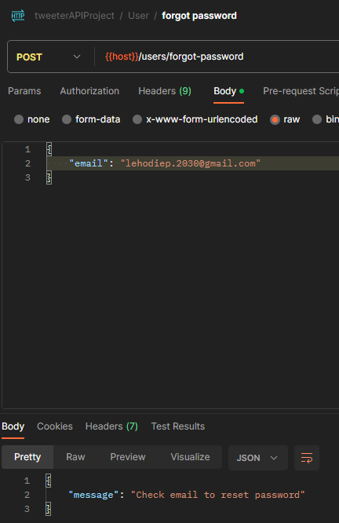
    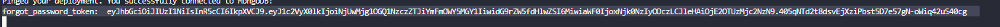
  - tạo request mới và gữi forgot_password_token lên để kiểm tra verify
    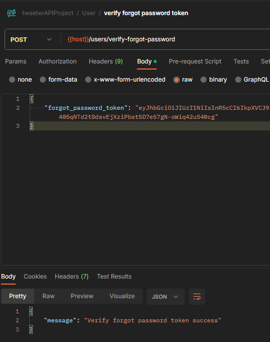

# reset password

- khi nhận đc thông tin VERIFY_FORGOT_PASSWORD_TOKEN_SUCCESS thì ta tiến hành cho người dùng reset password
  ta tiến hành cập nhật password vào trong document user của nó,
- vậy route `/reset-password` sẽ nhận vào `forgot_password_token`(để biết cập nhật password cho ai), `new_password` và `confirm_new_password`, dùng method post, gữi thông qua body
- vào `users.routes.ts` thêm route `/reset-password`

  ```ts
  /*
  des: reset password
  path: '/reset-password'
  method: POST
  Header: không cần, vì  ngta quên mật khẩu rồi, thì sao mà đăng nhập để có authen đc
  body: {forgot_password_token: string, password: string, confirm_password: string}
  */
  usersRouter.post(
    "/reset-password",
    resetPasswordValidator,
    wrapAsync(resetPasswordController)
  );
  ```

- ta vào `User.requests.ts` để định nghĩa `reqbody` cho route trên

  ```ts
  export interface ResetPasswordReqBody {
    forgot_password_token: string;
    password: string;
    confirm_password: string;
  }
  ```

- vào file `users.middlewares.ts` tạo middleware `resetPasswordValidator`

  - ta thấy rằng trong reset password cũng có validator password và confirm_password như registerValidator
    nên ta sẽ tạo chung cho `password` và `confirm_password` những cái biến để tiện việc tái sử dụng
  - đầu tiên tạo 2 biến chứa giá trị của `password` và `confirm_password` của `register`

    ```ts
    const passwordSchema: ParamSchema = {
      notEmpty: {
        errorMessage: USERS_MESSAGES.PASSWORD_IS_REQUIRED
      },
      isString: {
        errorMessage: USERS_MESSAGES.PASSWORD_MUST_BE_A_STRING
      },
      isLength: {
        options: {
          min: 8,
          max: 50
        },
        errorMessage: USERS_MESSAGES.PASSWORD_LENGTH_MUST_BE_FROM_8_TO_50
      },
      isStrongPassword: {
        options: {
          minLength: 8,
          minLowercase: 1,
          minUppercase: 1,
          minNumbers: 1,
          minSymbols: 1
          // returnScore: false
          // false : chỉ return true nếu password mạnh, false nếu k
          // true : return về chất lượng password(trên thang điểm 10)
        }
      },
      errorMessage: USERS_MESSAGES.PASSWORD_MUST_BE_STRONG
    }

    const confirmPasswordSchema: ParamSchema = {
      notEmpty: {
        errorMessage: USERS_MESSAGES.CONFIRM_PASSWORD_IS_REQUIRED
      },
      isString: {
        errorMessage: USERS_MESSAGES.CONFIRM_PASSWORD_MUST_BE_A_STRING
      },
      isLength: {
        options: {
          min: 8,
          max: 50
        },
        errorMessage: USERS_MESSAGES.CONFIRM_PASSWORD_LENGTH_MUST_BE_FROM_8_TO_50
      },
      isStrongPassword: {
        options: {
          minLength: 8,
          minLowercase: 1,
          minUppercase: 1,
          minNumbers: 1,
          minSymbols: 1
        },
        errorMessage: USERS_MESSAGES.CONFIRM_PASSWORD_MUST_BE_STRONG
      },
      custom: {
        options: (value, { req }) => {
          if (value !== req.body.password) {
            throw new Error(USERS_MESSAGES.CONFIRM_PASSWORD_MUST_BE_THE_SAME_AS_PASSWORD)
          }
          return true
        }
      }
    }

    //ta sẽ fix lại registerValidator thành

    export const registerValidator = validate(
      checkSchema(
        {
          ...
          password: passwordSchema,
          confirm_password: confirmPasswordSchema,
          ...
        }
      )
    )
    ```

  - ta làm tương tự với `forgot_password_token` của `verifyForgotPasswordTokenValidator`
    vì tí nữa trong `resetPasswordValidator` ta cũng cần tái sử dụng `forgot_password_token`

    ```ts
    const forgotPasswordTokenSchema: ParamSchema = {
      trim: true,
      custom: {
        options: async (value, { req }) => {
          //nếu k truyền lên forgot_password_token thì ta sẽ throw error
          if (!value) {
            throw new ErrorWithStatus({
              message: USERS_MESSAGES.FORGOT_PASSWORD_TOKEN_IS_REQUIRED,
              status: HTTP_STATUS.UNAUTHORIZED, //401
            });
          }
          //nếu có thì decode nó để lấy đc thông tin của người dùng
          try {
            const decoded_forgot_password_token = await verifyToken({
              token: value,
              secretOrPublicKey: process.env
                .JWT_SECRET_FORGOT_PASSWORD_TOKEN as string,
            });
            //lưu decoded_forgot_password_token vào req để khi nào muốn biết ai gữi req thì dùng
            (req as Request).decoded_forgot_password_token =
              decoded_forgot_password_token;
            //dùng user_id trong decoded_forgot_password_token để tìm user trong database
            //sẽ nhanh hơn là dùng forgot_password_token(value) để tìm user trong database
            const { user_id } = decoded_forgot_password_token;
            const user = await databaseService.users.findOne({
              _id: new ObjectId(user_id),
            });
            //nếu k tìm đc user thì throw error
            if (user === null) {
              throw new ErrorWithStatus({
                message: USERS_MESSAGES.USER_NOT_FOUND,
                status: HTTP_STATUS.UNAUTHORIZED, //401
              });
            }
            //nếu forgot_password_token đã được sử dụng rồi thì throw error
            //forgot_password_token truyền lên khác với forgot_password_token trong database
            //nghĩa là người dùng đã sử dụng forgot_password_token này rồi
            if (user.forgot_password_token !== value) {
              throw new ErrorWithStatus({
                message: USERS_MESSAGES.INVALID_FORGOT_PASSWORD_TOKEN,
                status: HTTP_STATUS.UNAUTHORIZED, //401
              });
            }
          } catch (error) {
            if (error instanceof JsonWebTokenError) {
              throw new ErrorWithStatus({
                message: capitalize((error as JsonWebTokenError).message),
                status: HTTP_STATUS.UNAUTHORIZED, //401
              });
            }
            throw error;
          }
          return true;
        },
      },
    };
    //giờ verifyForgotPasswordTokenValidator sẽ fix thành

    export const verifyForgotPasswordTokenValidator = validate(
      checkSchema(
        {
          forgot_password_token: forgotPasswordTokenSchema,
        },
        ["body"]
      )
    );
    ```

  - và giờ ta tạo `resetPasswordValidator`

    ```ts
    export const resetPasswordValidator = validate(
      checkSchema(
        {
          password: passwordSchema,
          confirm_password: confirmPasswordSchema,
          forgot_password_token: forgotPasswordTokenSchema,
        },
        ["body"]
      )
    );
    ```

- vào `users.controllers.ts` tạo `resetPasswordController`

  ```ts
  export const resetPasswordController = async (
    req: Request<ParamsDictionary, any, ResetPasswordReqBody>,
    res: Response,
    next: NextFunction
  ) => {
    //middleware resetPasswordValidator đã chạy rồi, nên ta có thể lấy đc user_id từ decoded_forgot_password_token
    const { user_id } = req.decoded_forgot_password_token as TokenPayload;
    const { password } = req.body;
    //vào database tìm user thông qua user_id này và cập nhật lại password mới
    //vì vào database nên ta sẽ code ở user.services
    const result = await usersService.resetPassword(user_id, password); //ta chưa code resetPassword
    return res.json(result);
  };
  ```

- vào `user.service.ts` code method `resetPassword`

  ```ts
    async resetPassword(user_id: string, password: string) {
      //tìm user thông qua user_id và cập nhật lại password và forgot_password_token
      //tất nhiên là lưu password đã hash rồi
      //ta không cần phải kiểm tra user có tồn tại không, vì forgotPasswordValidator đã làm rồi
      databaseService.users.updateOne({ _id: new ObjectId(user_id) }, [
        {
          $set: {
            password: hashPassword(password),
            forgot_password_token: '',
            updated_at: '$$NOW'
          }
        }
      ])
      //nếu bạn muốn ngta đổi mk xong tự động đăng nhập luôn thì trả về access_token và refresh_token
      //ở đây mình chỉ cho ngta đổi mk thôi, nên trả về message
      return {
        message: USERS_MESSAGES.RESET_PASSWORD_SUCCESS
      }
    }
    //vào messages.ts thêm RESET_PASSWORD_SUCCESS: 'Reset password success'
  ```

- test code
- chạy forgot password
  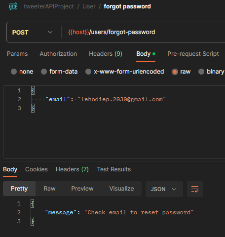
- email nhận đc forgot_password_token
  

- tạo request mới sử dụng forgot_password_token(k check verify vì chính ta tạo ra) để đổi mật khẩu
  nhưng cố tình nhập sai confirm_password
  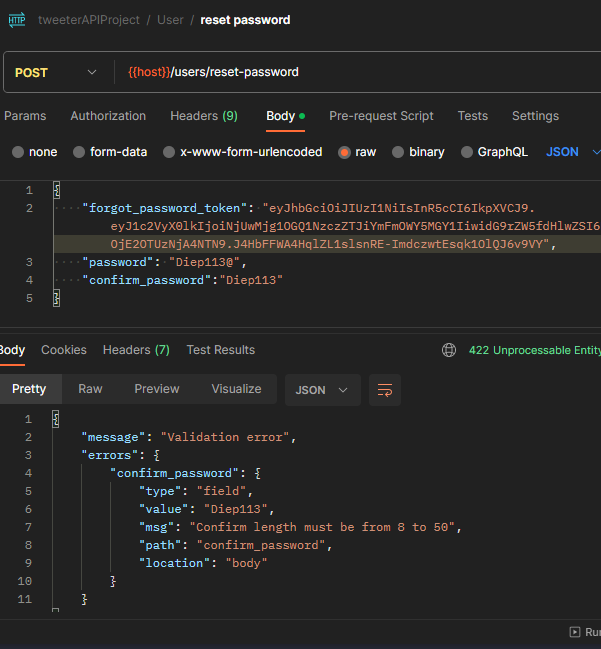
  lỗi 422 hợp lý
- làm lại cho đúng
  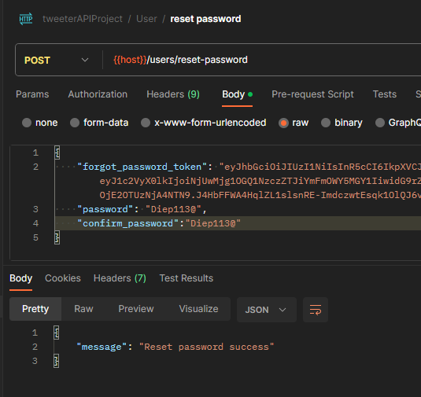
- qua login đăng nhập bằng mật khẩu mới
  - sai mật khẩu
    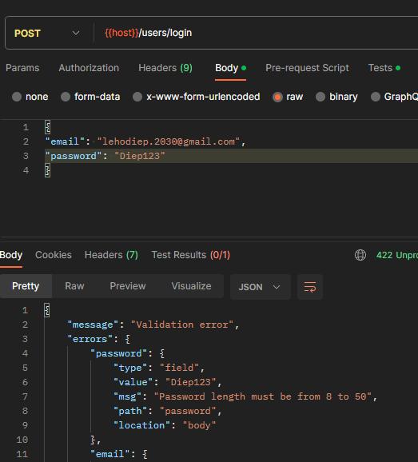
  - đúng mật khẩu
    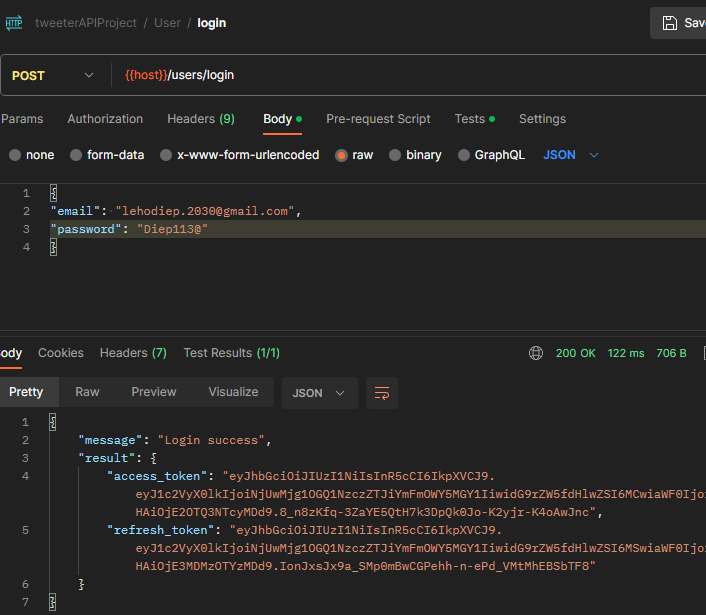

# tính năng Get Me

- mỗi lần ta vào trong 1 trang web như fb, ig, twitter thì trang sẽ get profile của chúng ta để hiển thị những
  thông tin của account mình, tính năng đó là getMe

  - vd: hiển thị avatar, tên account,
  - dù chưa verify account thì vẫn hiển thị bình thường, và sẽ có 1 khu vực thông báo trên trang khuyên người dùng verify
  - vậy chỉ cần bạn đăng nhập, đưa mình access_token thì mình sẽ decode và gữi mấy thông tin account cơ bản cho bạn là xong

- trong `users.routes.ts` tạo route `/me`

  ```ts
  /*
  des: get profile của user
  path: '/me'
  method: get
  Header: {Authorization: Bearer <access_token>}
  body: {}
  */
  usersRouter.get("/me", accessTokenValidator, wrapAsync(getMeController));
  export default usersRouter;
  ```

- trong `users.controllers.ts` tạo `getMeController`

```ts
export const getMeController = async (
  req: Request,
  res: Response,
  next: NextFunction
) => {
  //middleware accessTokenValidator đã chạy rồi, nên ta có thể lấy đc user_id từ decoded_authorization
  const { user_id } = req.decoded_authorization as TokenPayload;
  //tìm user thông qua user_id này và trả về user đó
  //truy cập vào database nên ta sẽ code ở user.services
  const user = await usersService.getMe(user_id); // hàm này ta chưa code, nhưng nó dùng user_id tìm user và trả ra user đó
  return res.json({
    message: USERS_MESSAGES.GET_ME_SUCCESS,
    result: user,
  });
};
//trong messages.ts thêm GET_ME_SUCCESS: 'Get me success'
```

- `user.services.ts` code method `getMe`

  ```ts
    async getMe(user_id: string) {
        const user = await databaseService.users.findOne(
          { _id: new ObjectId(user_id) },
          {
            projection: {
              password: 0,
              email_verify_token: 0,
              forgot_password_token: 0
            }
          }
        )
        return user // sẽ k có những thuộc tính nêu trên, tránh bị lộ thông tin
      }
    }
    //trong dó projection giúp ta loại bỏ lấy về các thuộc tính như password, email_verify_token, forgot_password_token
  ```

- test code
  - ta login để có accesstoken, script sẽ tự lưu vào enviroment
    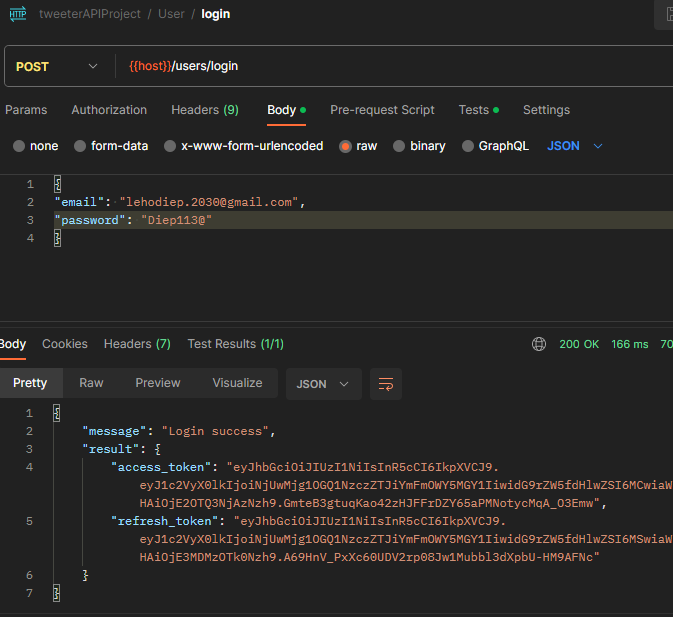
  - tạo request
    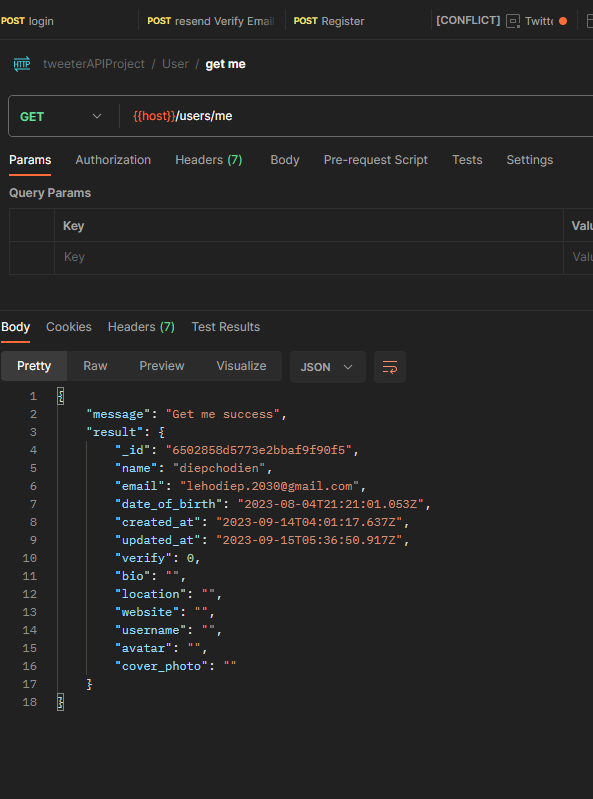
  - nếu thiếu accesstoken thì
    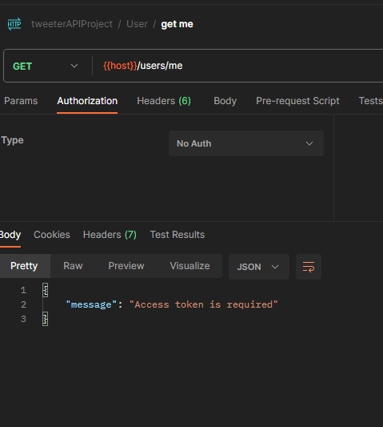

# MongoDB Schema Validation

- hiện tại chúng ta đã:
  - validate dữ liệu ở tầng `middleware`, nhưng chưa làm nó ở tằng `database`
  - chúng ta đã tạo ra các object cho đúng định dạng với trước khi chèn vào `database`
  - bằng cách dùng cú pháp `new User`(ví dụ trong `users.service.ts > register`)
- nhưng những điều trên là chưa đủ, vì:
  - nếu ta khai báo `User.schema.ts > User` ta có thể bị thừa field hay thiếu field so với trên `database`
  - nếu dùng `js` có thể sẽ không check kiểu dữ liệu chặc chẽ như `ts`
- vậy nên ta cần tạo 1 validator ở tằng `database` để khi ta truyền `object` lên, nó sẽ kiểm tra xem object có đầy đủ các trường dữ liệu hay không

### tóm tắt tài liệu

- I. ta đọc tài liệu tham khảo trước: [schema validation mongodb](https://www.mongodb.com/docs/manual/core/schema-validation/specify-json-schema/)

  - 1 . tiến hành tạo validation cho collection như doc
    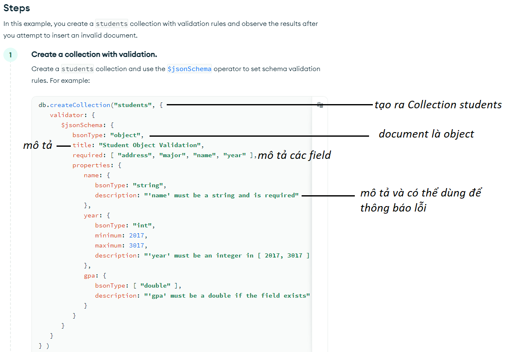
    - ở bsonType: `["double", "string"]` nghĩa là ta có thể khai báo nhiều kiểu trên 1 field
  - 2 . ta có thể thử chèn 1 document vào xem sao
    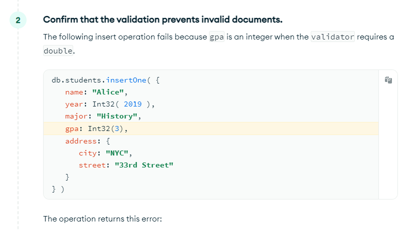
    - trong mô tả, họ cố tình chèn gpa là int thay vì double
    - lỗi sẽ là:
      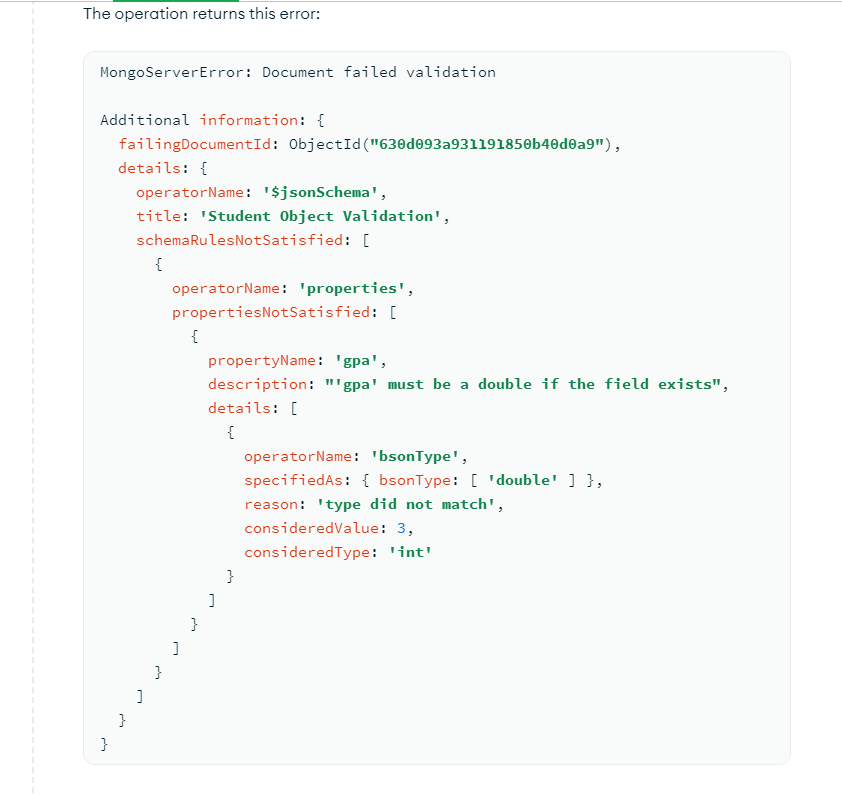
  - 3 . truyền đúng thì không hiển thị gì cả
    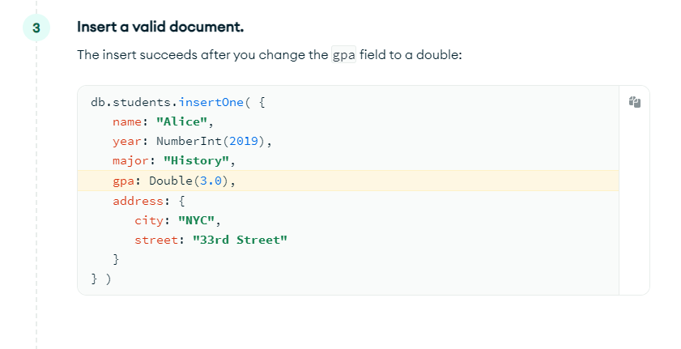
  - 4 . ta có thể thực hiện việc tìm kiếm để xem kết quả
    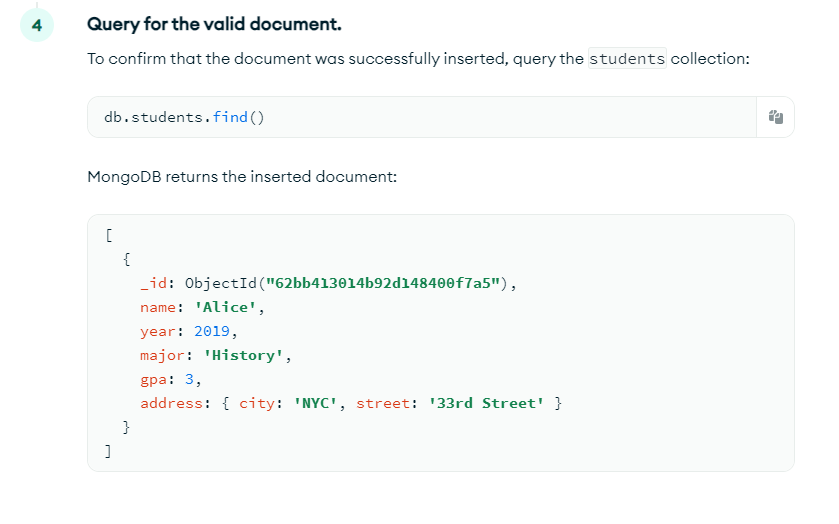

- II. vậy nếu ta có collection từ trước thì sao

  - build role trong database
    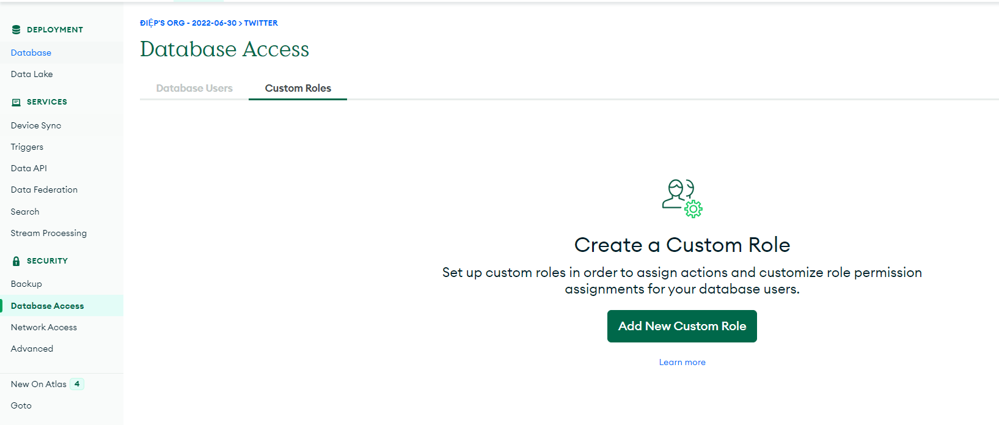
    tạo role cho phép chỉnh sửa
    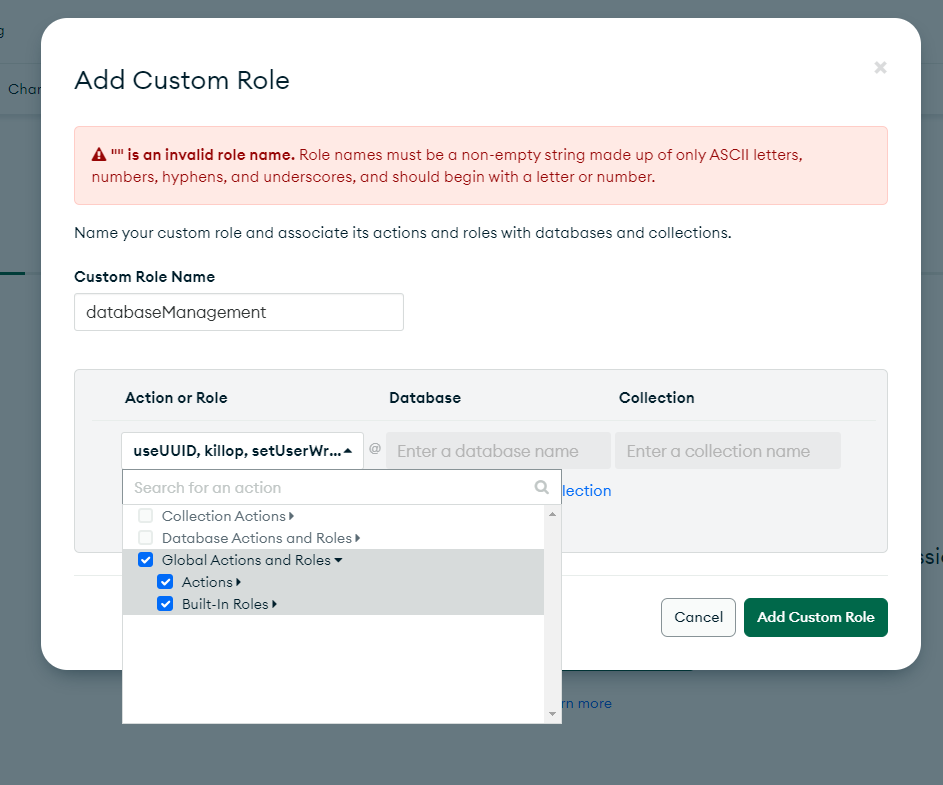
    setting cho account nhận role
    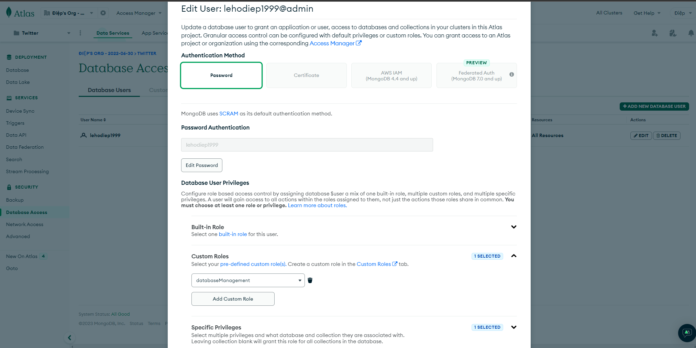
  - ta ví dụ như collection `User` của ta, ta chỉ cần bấm add rule là đc
    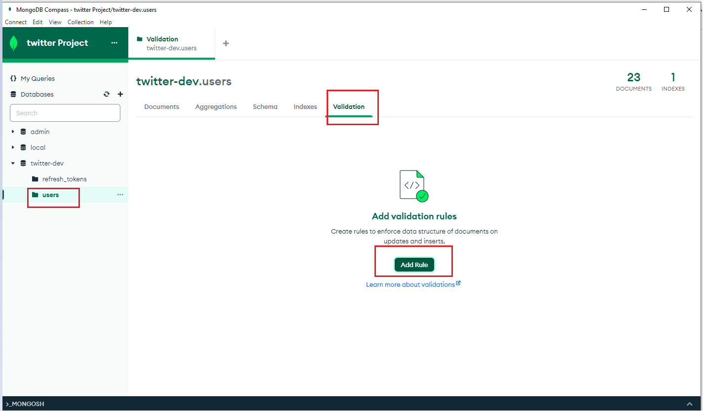
  - giờ ta sẽ làm thử với collection `refresh_tokens`
    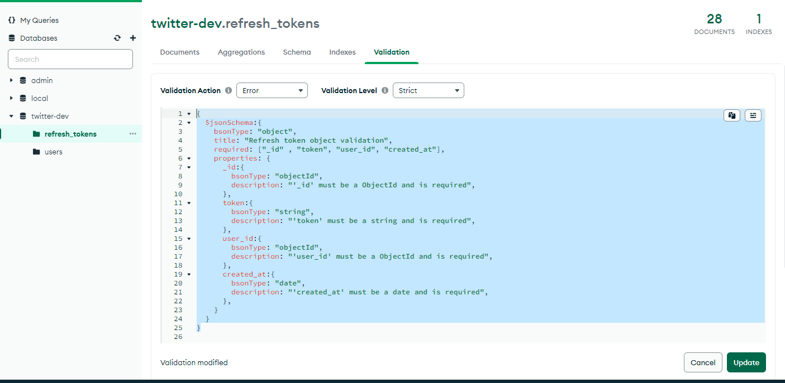
    ```js
    {
      $jsonSchema:{
        bsonType: "object",
        title: "Refresh token object validation",
        required: ["_id" , "token", "user_id", "created_at"],
        properties: {
          _id:{
            bsonType: "objectId",
            description: "'_id' must be a ObjectId and is required",
          },
          token:{
            bsonType: "string",
            description: "'token' must be a string and is required",
          },
          user_id:{
            bsonType: "objectId",
            description: "'user_id' must be a ObjectId and is required",
          },
          created_at:{
            bsonType: "date",
            description: "'created_at' must be a date and is required",
          },
        }
      }
    }
    ```
    trong đó
    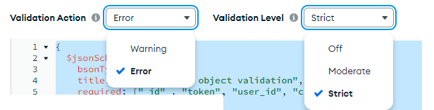
    - `Validation Action` : phát sinh lỗi dưới dạng `warning hay lỗi`
    - `Validation Level` :
      - `off`: tắt
      - `strict`: thêm rule cho tất cả cả insert và update
      - `moderate`: nó sẽ k áp dụng với `document` đã tạo trước khi add rule
    - ở đây mình để mặt định là `error` và `strict`
  - thử dùng mongosh để add 1 document bị lỗi vào xem sao

    ```sql
      use twitter-dev
      db.refresh_tokens.insertOne({token: 100, user_id: ObjectId(), created_at: new Date()})
      //MongoServerError: Document failed validation
      //phải cho token là string mới được
    ```

    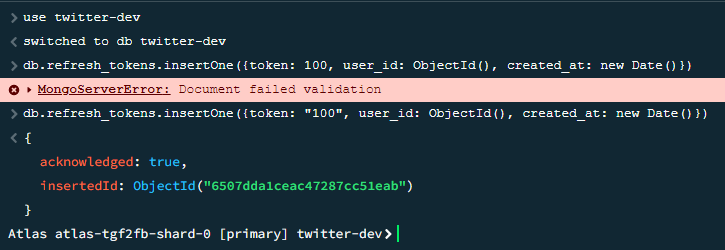

  - nếu ta add dư property thì nó vẫn sẽ cho add vào

    ```
      db.refresh_tokens.insertOne({token: "100", user_id: ObjectId(), created_at: new Date(),name: "ahihi"})
    ```

  - trong rule ta thêm `additionalProperties: false` thì ta sẽ k tạo dư được
    nhưng nhớ rằng nếu dùng `additionalProperties: false` phải tạo trước `_id` trong property
    nếu không mongo sẽ nghĩ \_id này bị dư

  - `required`: đã giúp mình cấm thiếu

  ```js
   {
     $jsonSchema:{
       bsonType: "object",
       title: "Refresh token object validation",
       required: ["_id" , "token", "user_id", "created_at"],
       properties: {
         ...
       },
       additionalProperties: false,
     }
   }
  ```

  - tiếp tục thêm rule cho collection `users`

  ```js
  {
    $jsonSchema: {
      bsonType: 'object',
      title: 'Refresh token object validation',
      required: [
        '_id',
        'name',
        'email',
        'date_of_birth',
        'password',
        'created_at',
        'updated_at',
        'email_verify_token',
        'forgot_password_token',
        'verify',
        'bio',
        'location',
        'website',
        'username',
        'avatar',
        'cover_photo'
      ],
      properties: {
        _id: {
          bsonType: 'objectId',
          description: '\'_id\' must be a ObjectId and is required'
        },
        name: {
          bsonType: 'string',
          description: '\'name\' must be a string and is required'
        },
        email: {
          bsonType: 'string',
          description: '\'email\' must be a string and is required'
        },
        date_of_birth: {
          bsonType: 'date',
          description: '\'date_of_birth\' must be a date and is required'
        },
        password: {
          bsonType: 'string',
          description: '\'password\' must be a string and is required'
        },
        created_at: {
          bsonType: 'date',
          description: '\'created_at\' must be a date and is required'
        },
        updated_at: {
          bsonType: 'date',
          description: '\'updated_at\' must be a date and is required'
        },
        email_verify_token: {
          bsonType: 'string',
          description: '\'email_verify_token\' must be a string and is required'
        },
        forgot_password_token: {
          bsonType: 'string',
          description: '\'forgot_password_token\' must be a string and is required'
        },
        verify: {
          bsonType: 'int',
          'enum': [
            0,
            1,
            2
          ]
        },
        bio: {
          bsonType: 'string',
          description: '\'bio\' must be a string and is required'
        },
        location: {
          bsonType: 'string',
          description: '\'location\' must be a string and is required'
        },
        website: {
          bsonType: 'string',
          description: '\'website\' must be a string and is required'
        },
        username: {
          bsonType: 'string',
          description: '\'username\' must be a string and is required'
        },
        avatar: {
          bsonType: 'string',
          description: '\'avatar\' must be a string and is required'
        },
        cover_photo: {
          bsonType: 'string',
          description: '\'cover_photo\' must be a string and is required'
        }
      },
      additionalProperties: false
    }
  }

  //để ý property verify để hiểu cách xài enum
  ```
